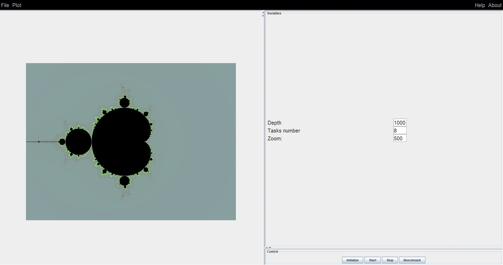
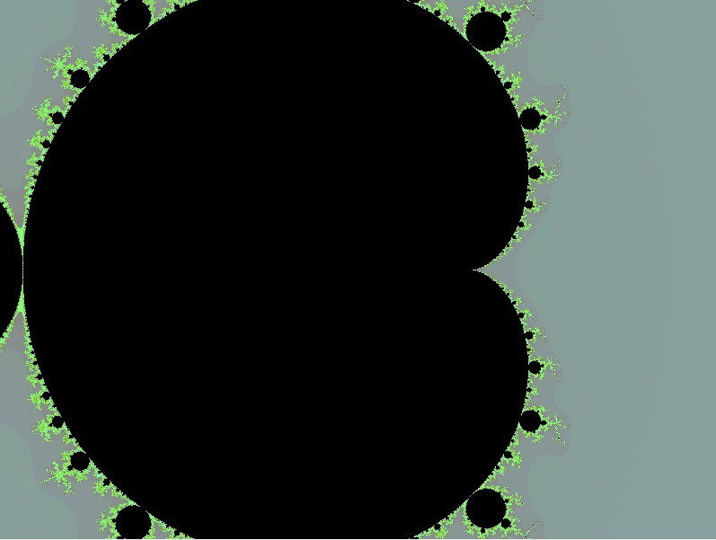
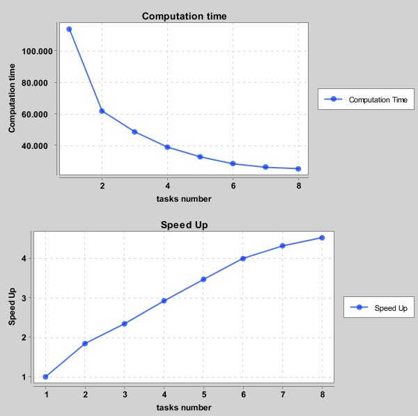

# Mandelbrot set

Parallel implementation with visualization (GUI) of mandelbrot set in Java.

### Variables

The GUI has three inputs:

- Depth: number of iterations

- Tasks Number: number of threads that will compute the simulation.

- Zoom: modifying this number you will change the scale computing differents parts of the Mandelbrot set:

### Benchmark Mode

Pushing benchmark button you will start bencharmk for 1 to N tasks computing the computation time and Speed Up and ploting the results on real time:

